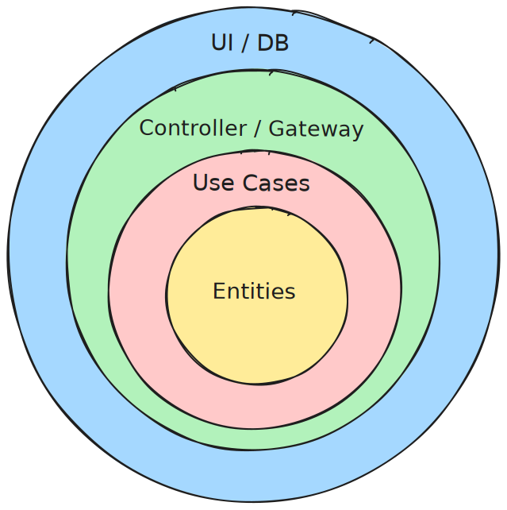

# Marginalia

[](https://github.com/igarash1/marginalia/actions/workflows/ci.yml)
[](https://codecov.io/gh/igarash1/marginalia?flags%5B0%5D=backend)
[](https://codecov.io/gh/igarash1/marginalia?flags%5B0%5D=frontend)

A library system prototype: cataloguing, patrons, and circulation. It has two faces — a
**staff console** (the circulation desk and catalog management) and a
**patron-facing OPAC** (the public catalog: search, place a hold, and a "my
library" view). The backend is Python and FastAPI. The frontend is React and
TypeScript. They ship as one app.

**Staff console** — load a patron, return and check out a copy, browse the catalog tree:


**Patron OPAC** — search, sign in with a card, place a hold, and a "my library" view:


## Goals

I used this project to practice a few things end to end.

- Model a real domain, not a toy. The catalog follows the FRBR layers: a work
  has manifestations, a manifestation has items.
- Keep the domain and the use cases free of any framework.
- Drive the work with tests, and keep the decisions in writing.
- Build a UI that talks to the real API.

## Architecture

The code follows Clean Architecture. Dependencies point inward.



- **UI / DB (Frameworks & Drivers)** — the React SPA, the SQLite/Postgres database, and
  Alembic migrations.
- **Controller / Gateway (Interface Adapters)** — FastAPI routers and Pydantic schemas,
  SQLAlchemy repositories on the way out.
- **Use Cases (Application Business Rules)** — use cases over repository ports.
- **Entities (Enterprise Business Rules)** — domain entities, the loan policy, and domain
  services.

The interface layer wires the ports to their adapters at startup. FastAPI serves
the built SPA, so the client and the API share one origin.

### SOLID

The implementation follows the SOLID principles.

#### Single responsibility

A class has one reason to change. Checking out a copy has three kinds of reason
to change, and each lives in its own place, so a change to one never touches the
others:

| What changes | Where it lives |
| --- | --- |
| Steps of the operation (orchestration) | use case — `CheckOut` |
| Borrowing rules (overdue, loan limits) | entity — `Patron.ensure_can_borrow` |
| Error mapping to HTTP | boundary — `interface/api/errors.py` |

#### Open/closed

Behaviour extends without editing what already works. Loan rules are injected
data behind a port (`LoanPolicyProvider`), so a new category × material rule is
added, not patched in.

| | Role | Here |
| --- | --- | --- |
| **Consumer** | Depends only on the port | `CheckOut` (use case) — calls `policy_for(...)` |
| **Port** | Contract | `LoanPolicyProvider` — "give me the policy for a (category, material) pair" |
| **Adapter** | Concrete implementation | `StaticLoanPolicyProvider` — looks the pair up in a rule matrix |


#### Liskov substitution

Any adapter is substitutable for the port it implements; nothing depends on which
concrete implementation it was handed.

#### Interface segregation

Many small, purpose-built interfaces over one wide one, so a caller depends only
on the methods it uses for less coupling: one repository per aggregate (`LoanRepository`,
`HoldRepository`, …), not a fat DAO.

#### Dependency inversion

Both sides depend on abstractions. The domain and application define the ports
(`UnitOfWork`, the repository protocols); infrastructure implements them
(`SqlAlchemyUnitOfWork`), and the wiring happens at a single composition root
(`interface/api/deps.py`).

Known trade-offs: the rule for handing a returned copy to the next reservation
in the queue is duplicated across a few use cases (`CheckIn`, `CancelHold`,
`ExpireReadyHolds`) rather than living in one domain service, and `UnitOfWork`
exposes every repository rather than only the ones a given use case needs.

## Technology

- Backend: Python, FastAPI, SQLAlchemy, Pydantic, Alembic.
- Frontend: React, TypeScript, Vite.
- Tests: pytest and Playwright.
- Storybook for the design system.
- CI: GitHub Actions runs the tests, the end-to-end suite, and a Storybook build
  on every pull request.

## Security posture

This is a portfolio project, not a deployable production system. Only the basic features are in place. Authentication, audit logging, etc. are missing.

## Documentation

| Doc | Lane |
| --- | --- |
| [SPEC.md](SPEC.md) | What the system does, as requirements traced to tests |
| [CONTEXT.md](CONTEXT.md) | The domain vocabulary |
| [docs/data-model.md](docs/data-model.md) | The schema and an ER diagram |
| [docs/adr/](docs/adr/) | Why the main decisions were made |
| [docs/design/0002-…](docs/design/0002-v1-backend-catalog-patrons-circulation.md) | How the v1 backend was built |
| [docs/design/2026-06-26-opac-design.md](docs/design/2026-06-26-opac-design.md) | How the patron-facing OPAC was designed |
| [backend/README.md](backend/README.md) | Run and test the API, migrations, tasks |
| [frontend/README.md](frontend/README.md) | Run and test the SPA, Storybook |

## Run

```sh
cd frontend && npm install && npm run build
cd ../backend && uv venv --python 3.12 && uv pip install -e ".[dev]"
uv run uvicorn app.main:create_app --factory
```

Then open <http://127.0.0.1:8000>.

## Test

```sh
cd backend  && uv run pytest
cd frontend && npm run test:e2e
cd frontend && npm run storybook
```
