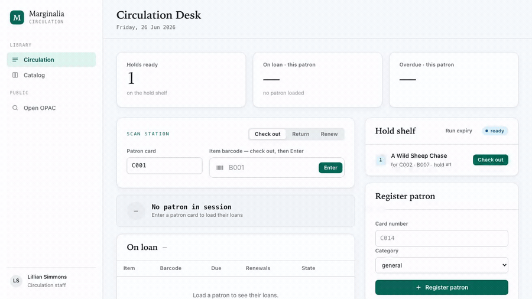
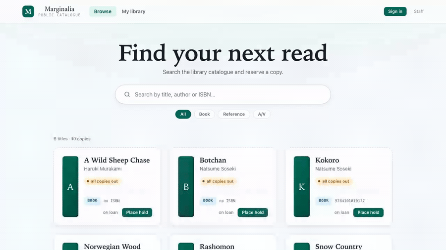
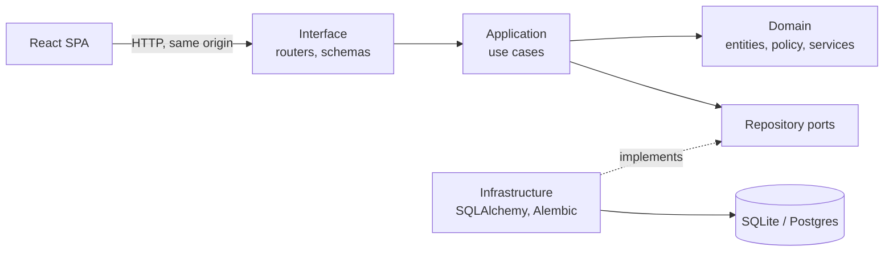

# Marginalia

A library system prototype: cataloguing, patrons, and circulation. It has two faces — a
**staff console** (the circulation desk and catalog management) and a
**patron-facing OPAC** (the public catalog: search, place a hold, and a "my
library" view). The backend is Python and FastAPI. The frontend is React and
TypeScript. They ship as one app.

**Staff console** — load a patron, return and check out a copy, browse the catalog tree:



**Patron OPAC** — search, sign in with a card, place a hold, and a "my library" view:



## Goals

I used this project to practice a few things end to end.

- Model a real domain, not a toy. The catalog follows the FRBR layers: a work
  has manifestations, a manifestation has items.
- Keep the domain and the use cases free of any framework.
- Drive the work with tests, and keep the decisions in writing.
- Build a UI that talks to the real API.

## Architecture

The code follows Clean Architecture. Dependencies point inward. The domain and
the application layers import no web or database library, and a test enforces
that.



- **Domain** — entities, the loan policy, and domain services. Plain Python.
- **Application** — use cases over repository ports.
- **Infrastructure** — SQLAlchemy repositories and Alembic migrations.
- **Interface** — FastAPI routers, Pydantic schemas, and the React SPA.

The interface layer wires the ports to their adapters at startup. FastAPI serves
the built SPA, so the client and the API share one origin.

The SPA carries both faces in one build: the hash route picks the shell — the
staff console (`#desk`, `#catalog`) or the patron OPAC (`#/opac`, `#/opac/me`).
The OPAC is layered entirely over the existing endpoints; it adds no backend
code. See [SPEC.md](SPEC.md) §6.

## Tech

- Backend: Python, FastAPI, SQLAlchemy, Pydantic, Alembic.
- Frontend: React, TypeScript, Vite.
- Tests: pytest and Playwright.
- Storybook for the design system.
- CI: GitHub Actions runs the tests, the end-to-end suite, and a Storybook build
  on every pull request.

## Security posture

This is a portfolio/demo system, not a production auth model. The app is meant
to run as a same-origin single service; no permissive CORS is enabled, inputs
are bounded at the API boundary, SQLAlchemy expression APIs are used instead of
string-built SQL, and database constraints backstop race-prone invariants such
as open loans and open holds. Patron OPAC sign-in is deliberately card-number
only and staff screens are not protected by real staff authentication in v1.

Before exposing it beyond a trusted demo environment, add production staff auth,
patron authentication, request rate limiting, audit logging, and deployment
secret management. Calling this out explicitly keeps reviewers from mistaking a
scoped demo boundary for a hidden production claim.

## Documentation

| Doc | Lane |
| --- | --- |
| [SPEC.md](SPEC.md) | What the system does, as requirements traced to tests |
| [CONTEXT.md](CONTEXT.md) | The domain vocabulary |
| [docs/data-model.md](docs/data-model.md) | The schema and an ER diagram |
| [docs/adr/](docs/adr/) | Why the main decisions were made |
| [docs/design/0002-…](docs/design/0002-v1-backend-catalog-patrons-circulation.md) | How the v1 backend was built |
| [docs/design/2026-06-26-opac-design.md](docs/design/2026-06-26-opac-design.md) | How the patron-facing OPAC was designed |
| [backend/README.md](backend/README.md) | Run and test the API, migrations, tasks |
| [frontend/README.md](frontend/README.md) | Run and test the SPA, Storybook |

## Run

```sh
cd frontend && npm install && npm run build
cd ../backend && uv venv --python 3.12 && uv pip install -e ".[dev]"
uv run uvicorn app.main:create_app --factory
```

Then open <http://127.0.0.1:8000>.

## Test

```sh
cd backend  && uv run pytest
cd frontend && npm run test:e2e
cd frontend && npm run storybook
```
