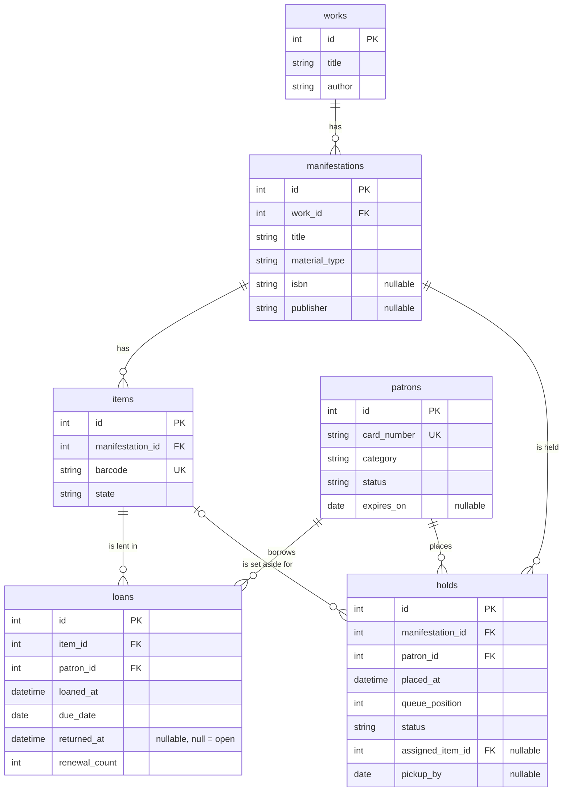

# Data model

The relational schema, owned by Alembic (`backend/alembic/versions/`). Entities
are separate aggregates and reference each other by id.

## Notes

- `loans` has a partial unique index `uq_open_loan_per_item` on `item_id` where
  `returned_at IS NULL`. A copy can have at most one open loan. See
  [ADR 0003](adr/0003-loan-aggregate-db-constraint.md).
- `holds` has a partial unique index
  `uq_open_hold_per_patron_manifestation` on `(manifestation_id, patron_id)`
  where `status IN ('pending', 'ready')`. A patron cannot occupy multiple open
  queue slots for the same manifestation.
- An item's `on_loan` and `on_hold_shelf` are not columns. They are derived from
  an open loan and an assigned ready hold. `items.state` holds only the
  intrinsic state: `available`, `in_repair`, `lost`, `withdrawn`.
- `loans.due_date` and `holds.pickup_by` are dates. The rest of the time fields
  are timestamps.
- `material_type`, `category`, item `state`, and hold `status` store the enum
  value as a string. The enums live in `backend/app/domain/value_objects.py`.
